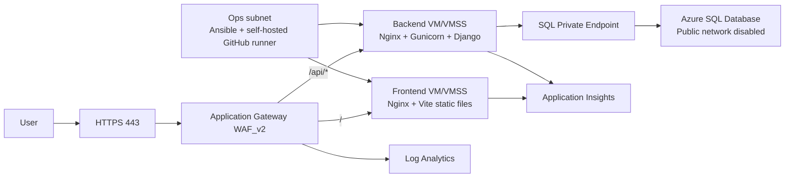

# FinTrack Azure 3-Tier Deployment

FinTrack is a React/Vite frontend with a Django REST backend. This repo now includes the automation structure for the Project 2 Azure target architecture:

- `infra/terraform`: Azure resource provisioning.
- `config/ansible`: VM configuration for frontend, backend, and SonarQube.
- `.github/workflows`: infrastructure and application CI/CD pipelines.
- `docs/runbook.md`: validation commands and demo script.

## Target Architecture



## Region

Use `centralindia` unless your instructor gives another allowed region. It is different from the forbidden list in the project brief.

## Provision Infrastructure

```bash
cd infra/terraform
cp terraform.tfvars.example terraform.tfvars
# edit terraform.tfvars locally; do not commit secrets
terraform init
terraform fmt -recursive
terraform validate
terraform plan
terraform apply
```

For GitHub Actions infra provisioning, configure these repository secrets:

```text
AZURE_CREDENTIALS
ADMIN_SOURCE_PREFIX
SSH_PUBLIC_KEY
SQL_ADMIN_PASSWORD
APPGW_SSL_CERTIFICATE_DATA
```
Note: the PFX password is optional. Leave `APPGW_SSL_CERTIFICATE_PASSWORD` unset when the PFX was exported with an empty password.

Do not remove `infra/terraform` from this repo. The infra workflow, rebuild procedure, architecture evidence, and project acceptance criteria all depend on it.
Infra workflow safety: push events run `terraform plan` only. `terraform apply` runs only from manual `workflow_dispatch` with `apply=true`, and only when the saved plan reports changes. Do not use `apply=true` until the GitHub workflow is configured to use the same remote Terraform state as the live deployment; otherwise Terraform can try to create a second resource group.

## Configure VMs With Ansible

Run from the ops/Ansible VM or any machine that can SSH to private VM IPs:

```bash
cd config/ansible
ansible all -i inventories/dev/hosts.ini -m ping
ansible-playbook -i inventories/dev/hosts.ini playbooks/site.yml
```

Set real values in `inventories/dev/group_vars/all.yml` or use Ansible Vault for secrets.

## Deploy Frontend

The frontend pipeline builds `FinTrack Frontend` on GitHub-hosted Ubuntu and deploys to the private frontend VMSS with Azure VMSS Run Command.

Local build:

```bash
cd "FinTrack Frontend"
npm ci --legacy-peer-deps
npm run build
```

For App Gateway same-origin routing, set:

```text
VITE_API_URL=https://<appgw-fqdn>
```

or leave it empty when the frontend is served from the same gateway host.

## Deploy Backend

The backend pipeline tests Django on GitHub-hosted Ubuntu, optionally runs SonarQube, then deploys to the private backend VMSS with Azure VMSS Run Command. It installs requirements, runs migrations, collects static files, and restarts `fintrack-backend`.

Backend production settings come from `/etc/fintrack/fintrack.env`, rendered by Ansible.

Required values:

```text
DJANGO_SECRET_KEY
DJANGO_DEBUG=False
DJANGO_ALLOWED_HOSTS=<appgw-fqdn>,<custom-domain>
CORS_ALLOW_ALL=False
CORS_ALLOWED_ORIGINS=https://<appgw-fqdn>
DB_HOST=<azure-sql-server>.database.windows.net
DB_NAME=<database-name>
DB_USER=sqladminuser
DB_PASSWORD=<secret>
APPLICATIONINSIGHTS_CONNECTION_STRING=<connection-string>
```

## Health Checks

Frontend probe:

```text
/
```

Backend probe:

```text
/api/health/
```

## Validation

```bash
curl -I https://<appgw-fqdn>/
curl https://<appgw-fqdn>/api/health/
```

Azure checks:

```bash
az vm list -g <resource-group> -d -o table
az sql server show -g <resource-group> -n <sql-server> --query publicNetworkAccess -o tsv
az network application-gateway show-backend-health -g <resource-group> -n <appgw-name> -o table
```

Expected result: frontend/backend compute have no public IPs, SQL public access is disabled, and App Gateway backend health is healthy.